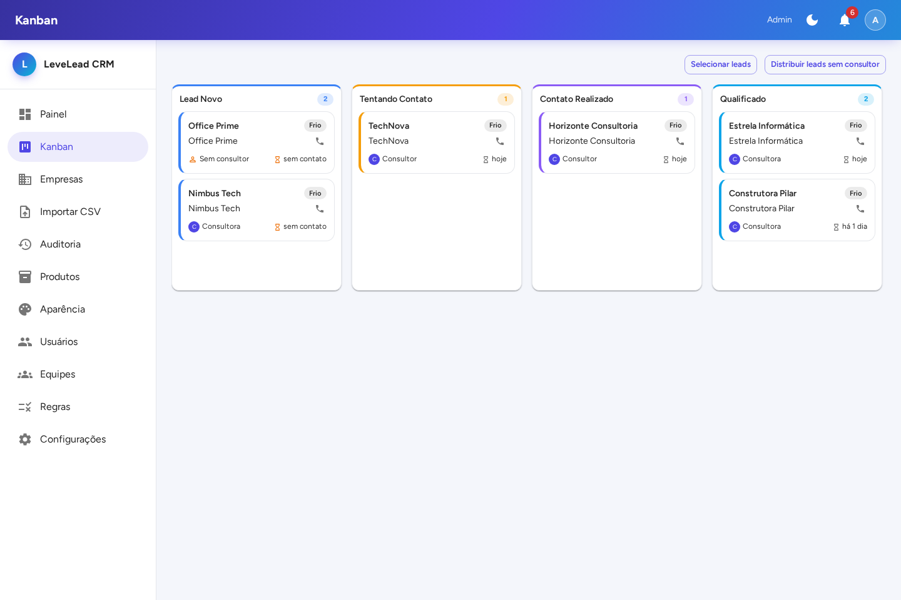
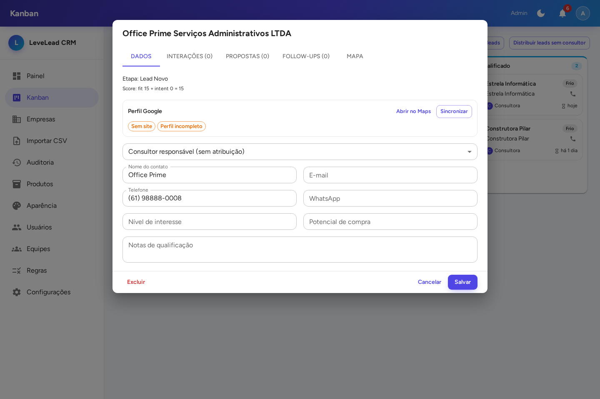
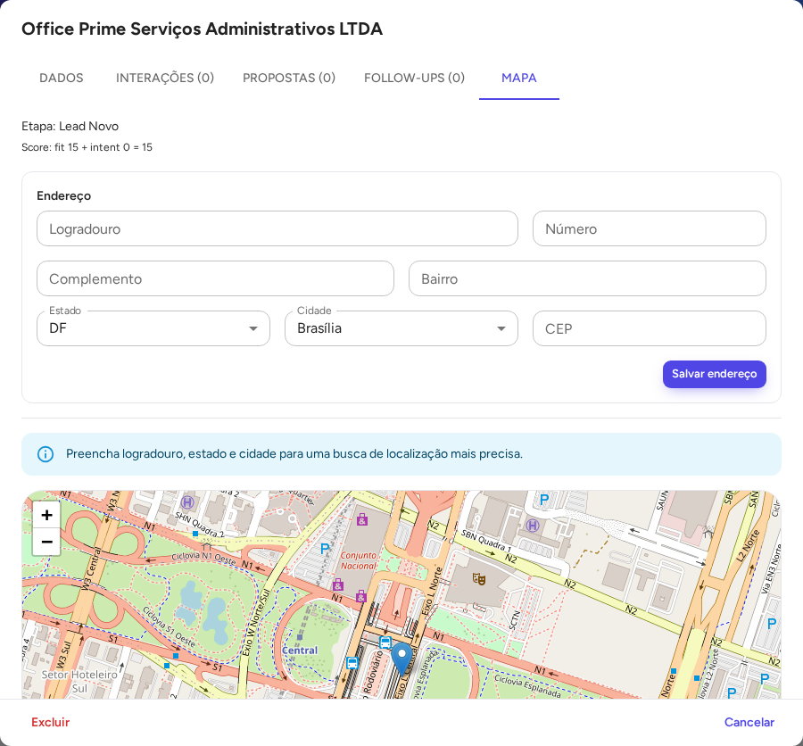
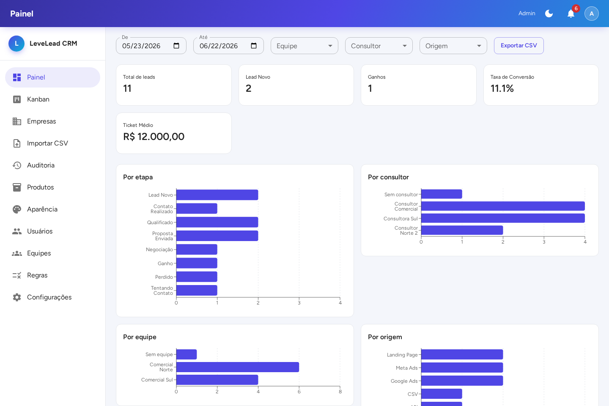
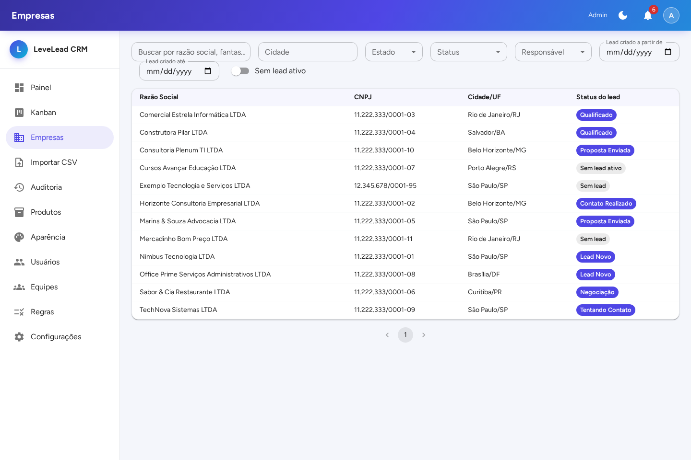
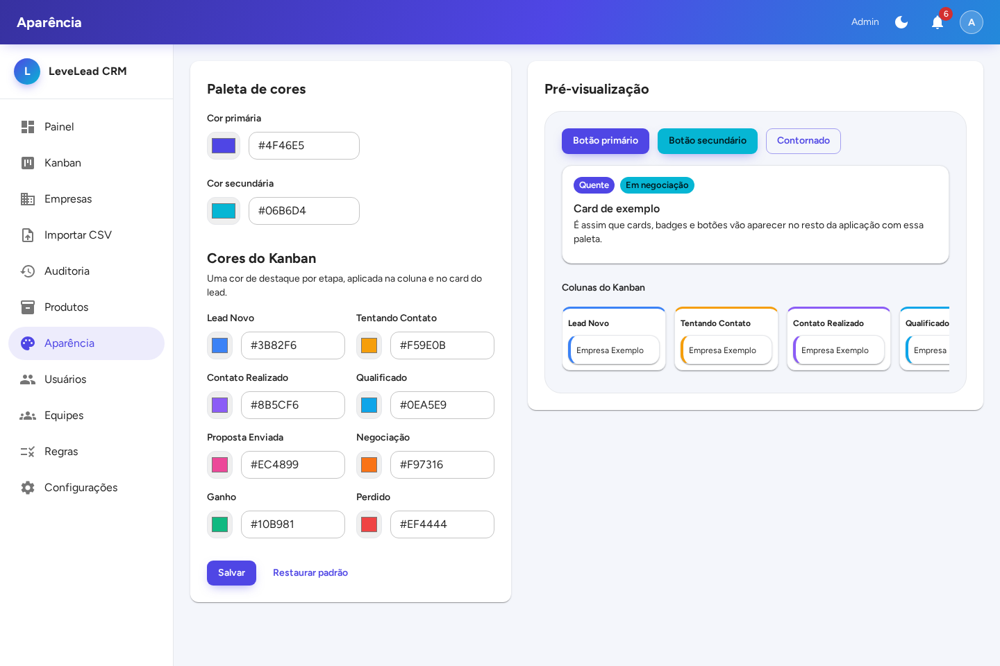

# LeveLead CRM — Kanban para Call Center Outbound

CRM completo para gestão de leads B2B em operação de call center outbound: funil Kanban com 8 etapas e drag-and-drop real, importação e enriquecimento de base de empresas via CNPJ (incluindo dados públicos do Google), distribuição automática de leads, lead scoring, SLA com alertas, compliance LGPD/ANATEL e auditoria com reconstrução de estado em qualquer ponto do tempo — tudo com identidade visual customizável pelo próprio administrador.

## Capturas de tela

| Kanban (cores por etapa, cards informativos) | Detalhe do lead (score, perfil Google, contato) |
|---|---|
|  |  |

| Mapa + endereço normalizado | Painel gerencial (gráficos) |
|---|---|
|  |  |

| Empresas (busca avançada) | Aparência (tema customizável) |
|---|---|
|  |  |

## Funcionalidades

**Funil de vendas**
- Kanban com 8 etapas (Lead Novo → ... → Ganho/Perdido), drag-and-drop real (`@dnd-kit`) com revalidação sempre no backend — o cliente nunca decide uma transição por conta própria.
- Retrocesso de 1 etapa com motivo obrigatório; perda e ganho com motivo/valor obrigatórios.
- Histórico unificado por lead (ligações, WhatsApp, e-mails, visitas, notas, mudanças de etapa, follow-ups) em uma única timeline por card.
- **Reciclagem de lead perdido**: reabre manualmente um lead perdido como um novo "Lead Novo" linkado ao anterior, com aviso (não-bloqueante) da janela sugerida de reabertura por motivo de perda.
- Propostas versionadas com upload de anexos; follow-ups agendados e concluídos.
- Ações em massa (atribuir/transferir, mover etapa) para múltiplos leads ao mesmo tempo.

**Dados de empresas (Company)**
- Importação de base via CSV com auto-detecção de colunas (tolerante a renomeação/reordenação) e mapeamento manual com perfis reutilizáveis.
- Dedupe por CNPJ, histórico de faturamento/dívida/situação cadastral, sócios e CNAEs.
- Endereço normalizado em tabela própria, com edição via Estado/Cidade em cascata (fixture oficial completo do IBGE — todos os ~5.571 municípios) e preenchimento automático a partir do CEP (ViaCEP).
- Enriquecimento automático via **Google Places API**: nota, nº de avaliações, categoria, status operacional, selos automáticos (sem site, poucas avaliações, nota baixa, perfil incompleto) e **localização no mapa** (Leaflet + OpenStreetMap), com busca de coordenadas a partir do endereço completo.
- Busca avançada por estado, cidade, responsável, etapa do lead e período.

**Distribuição, scoring e SLA**
- Distribuição automática por round-robin global, por equipe, por estado ou por região (macrorregião IBGE), com fallback global.
- Lead scoring (fit score firmográfico + intent score por engajamento, com decaimento por inatividade) — badges Quente/Morno/Frio.
- Alertas de SLA (sem interação em 24h, negociação longa, sem retorno, tentativas esgotadas) com auto-resolução e notificação in-app para gestores.

**Compliance (LGPD/ANATEL)**
- Validação da janela permitida de ligação, opt-out por empresa/telefone/e-mail, aviso de empresa baixada/inapta e contador de frequência de discagem — todo aviso é **não-bloqueante**: avisa e exige confirmação explícita, nunca impede o registro.
- Arquivamento automático de leads antigos sem resposta.

**Auditoria**
- Toda alteração em Lead/Company/Proposal/FollowUp/Address é capturada automaticamente (quem, quando, de onde — usuário, sistema ou importação) em uma trilha append-only, nunca editável ou removível.
- Reconstrução de estado em qualquer ponto do passado (somente leitura) a partir dos diffs registrados.

**Painel gerencial**
- Taxa de conversão e ticket médio segmentáveis por período, equipe, consultor e origem.
- Gráficos (`recharts`) por etapa, consultor, equipe e origem; exportação CSV linha a linha.
- Digest diário por e-mail dos alertas de SLA em aberto.

**Administração**
- CRUD completo de usuários, equipes, produtos e regras de distribuição/scoring (com RBAC de 3 papéis: admin, manager, consultant).
- Página de Configurações para parâmetros de negócio (limites de compliance, janelas de SLA, scoring, orçamento da API do Google) e chave de API, com passo a passo de como gerá-la.
- Tema visual customizável (cor primária/secundária, cor por etapa do Kanban, modo claro/escuro) com pré-visualização ao vivo, aplicado em toda a aplicação — inclusive na tela de login.

**Qualidade de dados na interface**
- Máscaras de CNPJ, telefone/celular/WhatsApp e CEP em todos os campos relevantes, sempre armazenando só os dígitos no banco.

## Stack tecnológica

- **Backend**: Laravel 13 (PHP 8.1+)
- **Frontend**: Inertia.js v2 + React 18 + MUI v9
- **Banco de dados**: MySQL
- **Drag-and-drop**: `@dnd-kit/core` + `@dnd-kit/sortable`
- **Mapas**: `react-leaflet` + tiles OpenStreetMap
- **Gráficos**: `recharts`
- **Integrações externas**: Google Places API (New), ViaCEP
- **Testes**: Pest (219 testes)
- **Ambiente local**: Laravel Sail (Docker)
- **Deploy**: VPS próprio, não gerenciado
- **Tenancy**: single-tenant na v1, com schema já preparado para multi-tenant futuro sem migração destrutiva

## Arquitetura (resumo)

- **Actions, não Controllers gordos**: lógica de escrita relevante mora em `app/Actions/{Domínio}/`.
- Toda transição de etapa do Kanban passa por um único serviço (`LeadStageTransitionService`), sempre dentro de transação — o frontend nunca é fonte de verdade.
- Auditoria automática via trait reutilizável aplicada aos models que precisam de trilha (`Lead`, `Company`, `Address`, `Proposal`, `FollowUp`), capturando diffs em qualquer caminho de escrita (UI, jobs, importação).
- Tabelas append-only (auditoria, histórico de etapas, interações) protegidas por Policy dedicada — nunca há `DELETE` permitido nelas.
- `Company` (dado cadastral) e `Lead` (funil de vendas) são entidades deliberadamente separadas, já que a mesma empresa pode gerar múltiplos leads ao longo do tempo.

Detalhe completo das decisões de arquitetura, modelo de dados e histórico de cada fase de implementação em [`docs/PLANO_IMPLEMENTACAO.md`](docs/PLANO_IMPLEMENTACAO.md).

## Como rodar localmente

```bash
cp .env.example .env
composer install
./vendor/bin/sail up -d
./vendor/bin/sail artisan key:generate
./vendor/bin/sail npm install
./vendor/bin/sail artisan migrate --seed
./vendor/bin/sail npm run build   # ou `npm run dev` para hot reload
./vendor/bin/sail test            # 219 testes Pest
```

Passo a passo completo (incluindo solução de problemas comuns) em [`docs/SETUP.md`](docs/SETUP.md).

## Documentação

- [`CLAUDE.md`](CLAUDE.md) — guia de convenções, arquitetura e estado detalhado de cada fase do projeto, mantido atualizado a cada entrega.
- [`docs/PLANO_IMPLEMENTACAO.md`](docs/PLANO_IMPLEMENTACAO.md) — plano completo de implementação: decisões de arquitetura, modelo de dados, auditoria/versionamento, compliance, lead scoring, máquina de estados do Kanban e histórico de cada fase entregue.
- [`docs/GLOSSARIO.md`](docs/GLOSSARIO.md) — dicionário dos termos de domínio (Lead, Company, stages, scores, compliance, auditoria).
- [`docs/SETUP.md`](docs/SETUP.md) — passo a passo de instalação e ambiente local.
